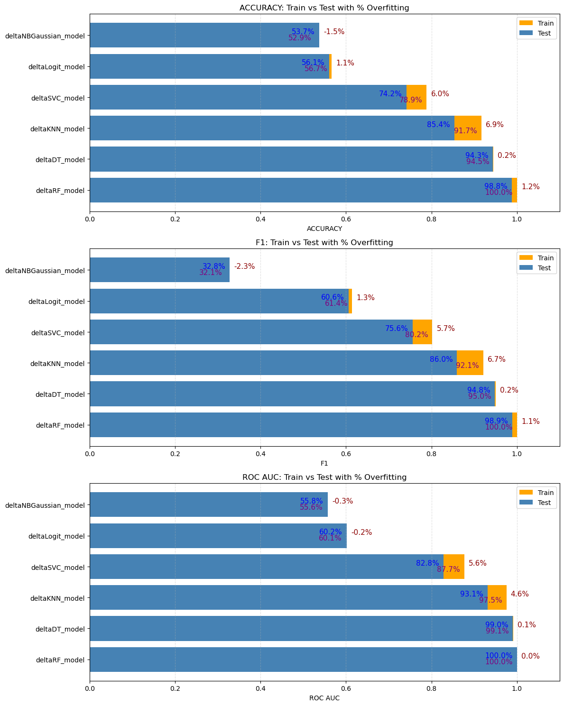
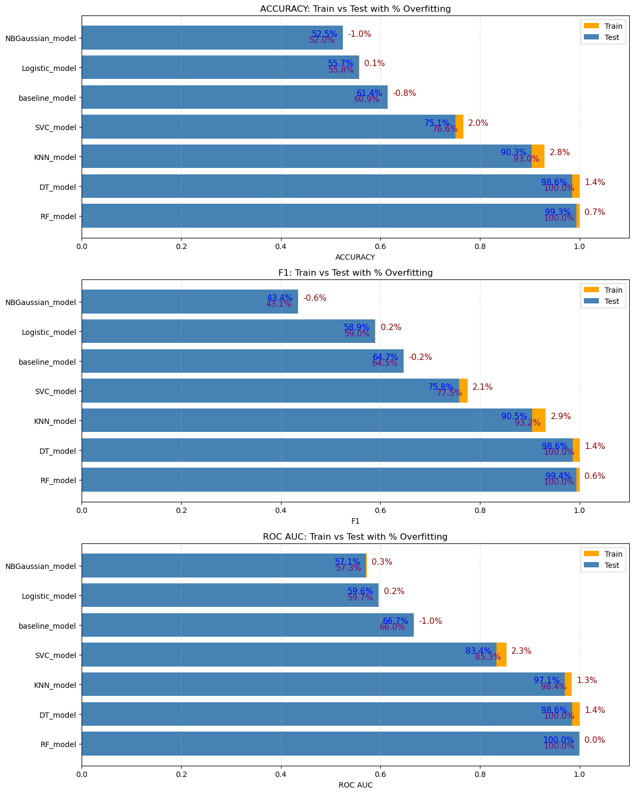
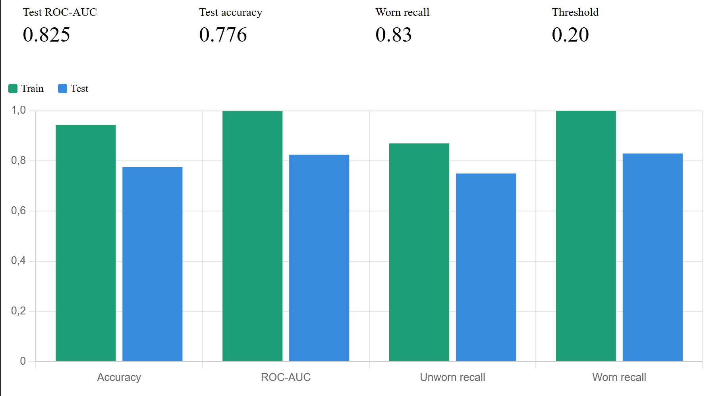

# CNC Tool Condition Prediction 

A machine learning project for **binary classification of CNC milling tool wear** (worn vs. unworn) from multi-sensor telemetry, with a primary focus on **detecting and preventing data leakage** in experiment-structured time-series data.

---

## Problem Statement

Tool wear detection in CNC machining is a high-value predictive maintenance task. A worn tool that goes undetected leads to **defective parts and potential machine damage** — making this an asymmetric-cost classification problem where missing a worn tool is far more expensive than a false alarm.

The core technical challenge is **not** the modeling itself, but the data structure:
- Each experiment produces thousands of sensor rows sharing a single label
- Naive row-level splitting causes severe **group leakage**
- The dataset is small (18 experiments), making metrics highly split-sensitive

The classifier must handle:
- Class imbalance (8 unworn vs. 10 worn experiments)
- Group-structured data requiring experiment-level splitting
- Asymmetric misclassification costs

---

## Dataset — CNC Mill Tool Wear

| Property | Value |
|----------|-------|
| Total experiments | 18 |
| Unworn tools | 8 experiments |
| Worn tools | 10 experiments |
| Data per experiment | Thousands of sensor readings (time-series) |
| Sensor channels | Position, velocity, acceleration, current, voltage, power (X/Y/Z/S axes) |
| Material | Wax |
| Clamp pressures | 2.5, 3.0, 4.0 bar |

The metadata file maps each experiment to its tool condition, feedrate, and clamp pressure. Each experiment's sensor stream is merged with these labels.

> Dataset: [CNC Mill Tool Wear — Kaggle](https://www.kaggle.com/datasets/shasun/tool-wear-detection-in-cnc-mill)

---

## Methodology

### 1. Data Assembly
Merged 18 experiment CSVs with metadata, adding `experiment_id` to enable correct group-based splitting.

### 2. Data Leakage Analysis
The central contribution of this project. Four splitting strategies were compared on identical data:

| Strategy | Test Accuracy | Validity |
|----------|--------------|----------|
| Row-level (shuffle=True) | ~97–100% | ❌ Group leakage |
| Row-level (shuffle=False) | ~87% | ❌ Boundary-dependent |
| **By experiment ID (stratified)** | **~71–78%** | ✅ Valid |
| GroupKFold CV | 0.36–0.92 (high variance) | ✅ Reveals dataset limits |

### 3. Feature Engineering
Two dataset variants following the "Target vs. Feedback" baseline:
- **Mutual dataset** — top 15 features via Mutual Information scoring
- **Delta dataset** — engineered tracking errors: `|Commanded − Actual|`

Physical intuition: a worn tool tracks commanded trajectories less accurately, so residual error grows.

### 4. Threshold Tuning
Decision threshold lowered from 0.5 to 0.20 to prioritize worn-tool recall, reflecting the asymmetric cost of missed detections.

---

## Key Findings

- **Data leakage detection:** Naive row-level splitting produced misleading ~100% accuracy. Correct experiment-level splitting revealed the honest performance.
- **Z1-axis dominance:** `Z1_ActualPosition` emerged as the strongest predictor — Z-axis depth tracking captures micro-deflections under vertical load.
- **Delta features improved discrimination:** Test ROC-AUC rose from 0.80 to 0.825.
- **Threshold tuning:** Worn recall raised to 0.83, reducing missed detections from ~37% to ~17%.
- **Final model — Random Forest on Delta features:** Chosen for parsimony — fewer engineered features at equivalent accuracy, yielding a more compact and efficient model for production.

---

## 📊 Results

Two dataset variants were benchmarked across seven models each, comparing Train vs. Test performance with the overfitting gap (%).

### Mutual Dataset (Top 15 features via Mutual Information)



| Model | Test Accuracy | Test ROC-AUC | Test F1 | Overfit Gap (AUC) |
|-------|--------------|--------------|---------|-------------------|
| **RF** (Random Forest) | 99.3% | 100.0% | 99.4% | 0.0% |
| **DT** (Decision Tree) | 98.6% | 98.6% | 98.6% | 1.4% |
| KNN | 90.3% | 97.1% | 90.5% | 1.3% |
| SVC | 75.1% | 83.4% | 75.8% | 2.3% |
| baseline | 61.4% | 66.7% | 64.7% | -1.0% |
| Logistic | 55.7% | 59.6% | 58.9% | 0.2% |
| NBGaussian | 52.5% | 57.1% | 43.4% | 0.3% |

### Delta Dataset (Engineered tracking errors: |Commanded − Actual|)



| Model | Test Accuracy | Test ROC-AUC | Test F1 | Overfit Gap (AUC) |
|-------|--------------|--------------|---------|-------------------|
| **RF** (Random Forest) | 98.8% | 100.0% | 98.9% | 0.0% |
| **DT** (Decision Tree) | 94.3% | 99.0% | 94.8% | 0.1% |
| KNN | 85.4% | 93.1% | 86.0% | 4.6% |
| SVC | 74.2% | 82.8% | 75.6% | 5.6% |
| Logistic | 56.1% | 60.2% | 60.6% | -0.2% |
| NBGaussian | 53.7% | 55.8% | 32.8% | -0.3% |

> **Engineering Note — Final Model Choice:**
> Tree-based models (RF, DT) dominate on both datasets, reaching near-100% Train metrics — a strong overfitting signal driven by the extreme isolated variance in the engineered `Z1_Position` residual.
>
> **The final model is Random Forest on the Delta dataset.** Despite the larger overfitting gap in linear/distance-based models, the Delta dataset requires fewer engineered features while matching the Mutual dataset's accuracy — making it more compact and computationally efficient for deployment. Random Forest's feature bagging mitigates the single-feature dominance better than a standalone Decision Tree, providing the best speed-to-accuracy trade-off for this task.

### Final Model (Random Forest + Threshold Tuning)

After lowering the decision threshold to 0.20 to prioritize worn-tool detection:

| Metric | Train | Test |
|--------|-------|------|
| Accuracy | 0.944 | 0.776 |
| ROC-AUC | 0.999 | 0.825 |
| Unworn recall | 0.87 | 0.75 |
| Worn recall | 1.00 | 0.83 |



---

## ⚠️ Limitations

With only 18 experimental groups, model metrics are highly sensitive to which experiments land in the test set (GroupKFold ROC-AUC varied 0.36–0.92). This is a **structural limitation of the dataset, not the modeling approach**. A production-ready model requires:

- More experiments (ideally 50+ tool runs)
- Greater tool variety (types, materials, wear stages)
- Intermediate wear states for gradual degradation modeling (RUL)

---

## 📁 Project Structure

```
CNC_ToolCondition_Prediction/
│
|
|── cnc_tool_condition.ipynb     # Main analysis notebook
│
├── results/
│   ├── benchmark_mutual.png         # Model comparison — Mutual dataset
│   ├── benchmark_delta.png          # Model comparison — Delta dataset
│   └── final_metrics.png            # Final model train vs test
│
├── input/
│   ├── train.csv                    # Metadata (experiment → tool condition)
│   └── experiment_XX.csv            # Sensor data per experiment
│
└── README.md
```

---

## 🛠️ Tech Stack

| Tool | Purpose |
|------|---------|
| scikit-learn | Modeling (KNN, Decision Tree, Random Forest, SVC, Logistic, Naive Bayes) |
| feature-engine | Yeo-Johnson transformation |
| pandas / numpy | Data manipulation & feature engineering |
| matplotlib | Visualization & benchmarking plots |
| Python 3 | Language |
